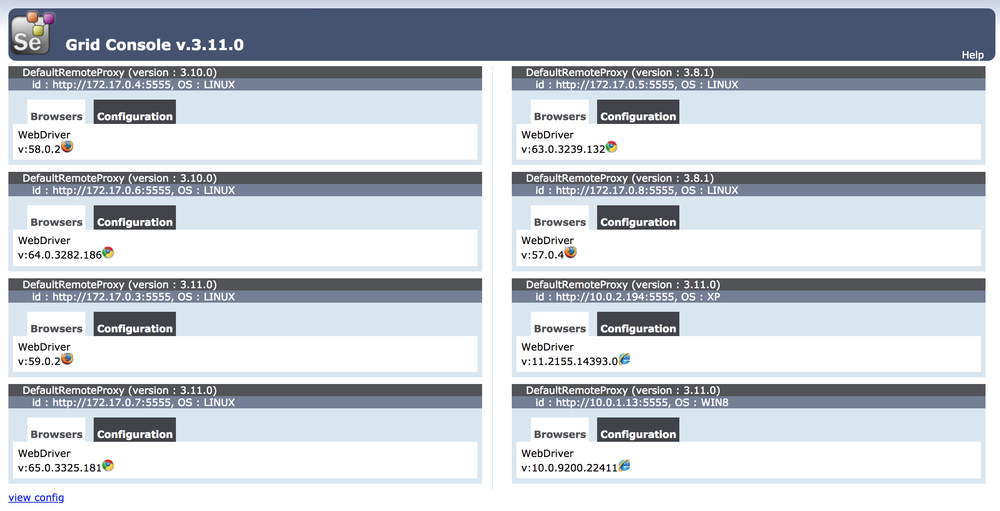

# Selenium & Cucumber Boilerplate



Node.JS boilerplate for Cucumber feature tests driven by Selenium, with multiple browser capabilities.

This project contains the following:

* [CloudFormation template](selenium.yml) for a _"throw away"_ Selenium Hub
* [CodePipeline CloudFormation template](pipeline.yml) demonstrating how to integrate Selenium tests into your CI/CD process.
* [Webdriver.io](http://webdriver.io/) providing Selenium bindings.
* [Cucumber JS](https://github.com/cucumber/cucumber-js) for composing feature tests.
* [Standard Step Defs.](https://github.com/webdriverio/cucumber-boilerplate) from Cucumber Boilerplate.
* Capability discovery & injection, using [selenium-grid-status](https://github.com/davglass/selenium-grid-status).
* Reports in [Allure](https://github.com/webdriverio/wdio-allure-reporter).

## Deploying Selenium Hub

The Hub can be deployed independently of any CI/CD Pipeline for development & testing purposes. Once deployed, tests can be executed against all supported capabilities, or specific browsers, using the below commands.

To get started, ensure that the [AWS CLI]() is installed and configured correctly. You will also need to create an EC2 Keypair either in the AWS Console, or by running `ec2 create-key-pair --key-name <NAME>`.

To deploy the Selenium Hub:
```
aws cloudformation deploy --template-file selenium.yml --capabilities CAPABILITY_IAM --stack-name `whoami`-selenium-hub --parameter-overrides IncludeIE=true KeyName=<KEYPAIR NAME>
```

Once the hub has been deployed successfully, you can query the HTTP endpoint for the hub, using the following command:
```
aws cloudformation describe-stacks --stack-name `whoami`-selenium-hub --query 'Stacks[0].Outputs[?OutputKey==`DNSName`].OutputValue' --output text
```

## Running tests

Now that you have the URL for the Selenium Hub, you're able to run feature tests locally, targeting specific capabilities, a single browser, or all capabilities. The target URL of the tests must be internet-accessible and public internet facing, so that Hub nodes are able to access the website.

#### Single Browser

Set tests to execute against a single browser, by defining the `$TARGET_BROWSER` environment variable.

```
npm run test:features --silent -- --host $SELENIUM_URL -b $TARGET_URL
```

#### Specific Browsers

Specific browsers can be tested by composing a `capabilities.json` file, with the following structure:

```json
[
  {
    "browserName": "firefox"
  },
  {
    "browserName": "chrome"
  },
  {
    "browserName": "internet explorer"
  }
]
```

You can then include these specific capabilities by passing the file as a command line flag, with the following command:

```
npm run test:features --silent -- --host $SELENIUM_URL -b $TARGET_URL --capabilities capabilities.json
```

#### All Browsers

In-order to execute tests against all supported browsers, we first need to discover capabilities, using the following command:

```
npm run test:features:capabilities --silent -- --host $SELENIUM_URL > capabilities.json
```

This command uses the `selenium-grid-status` NPM library to discover Hub Node capabilities. Once this command has executed successfully, we can execute tests by running the command demonstrated in [Specific Browsers](#specific-browsers).

## CI/CD Pipeline

## Generating Reports
